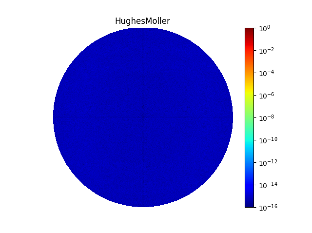
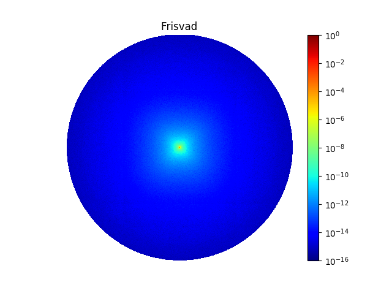
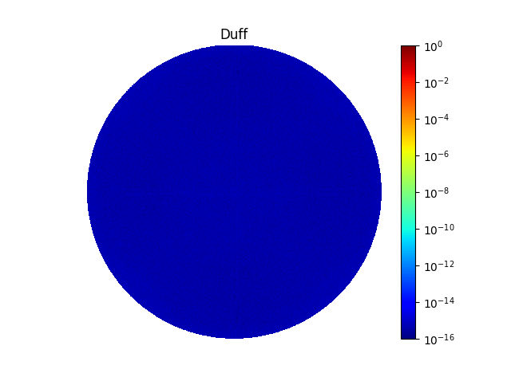

[![Code quality][s1]][co] [![License][s2]][li]

[s1]: https://app.codacy.com/project/badge/Grade/5db9d4e0cab34f14b019717fed343b6b
[s2]: https://img.shields.io/badge/licence-GPL%203.0-blue.svg

[co]: https://app.codacy.com/gh/matt77hias/basispy/dashboard?utm_source=gh&utm_medium=referral&utm_content=&utm_campaign=Badge_grade
[li]: https://raw.githubusercontent.com/matt77hias/basispy/master/LICENSE.txt

# basispy

## About
Utilities for calculating (orthonormal) bases.

## Use

<p align="center">



</p>

**Largest Error**
* Hughes-Möller: 1.19906977865e-14
* Frisvad: 0.0251273226272
* Duff: 5.49560397189e-15

```python
# Code
test.test()
```

## Bibliography
HUGHES, J. F., MÖLLER, T.: Building an Orthonormal Basis from a Unit Vector. *Journal of Graphics Tools 4 (1999)*, 4, pp. 33-35.

FRISVAD, J. R.: Building an Orthonormal Basis from a 3D Unit Vector Without Normalization. *Journal of Graphics Tools 16 (2012)*, 3, pp. 151–159.

DUFF T., BURGESS J., CHRISTENSEN P., HERY C., KENSLER A., LIANI M., VILLEMIN R.: Building an Orthonormal Basis, Revisited. *Journal of Computer Graphics Techniques 6 (2017)*, 1, pp. 1-8.
